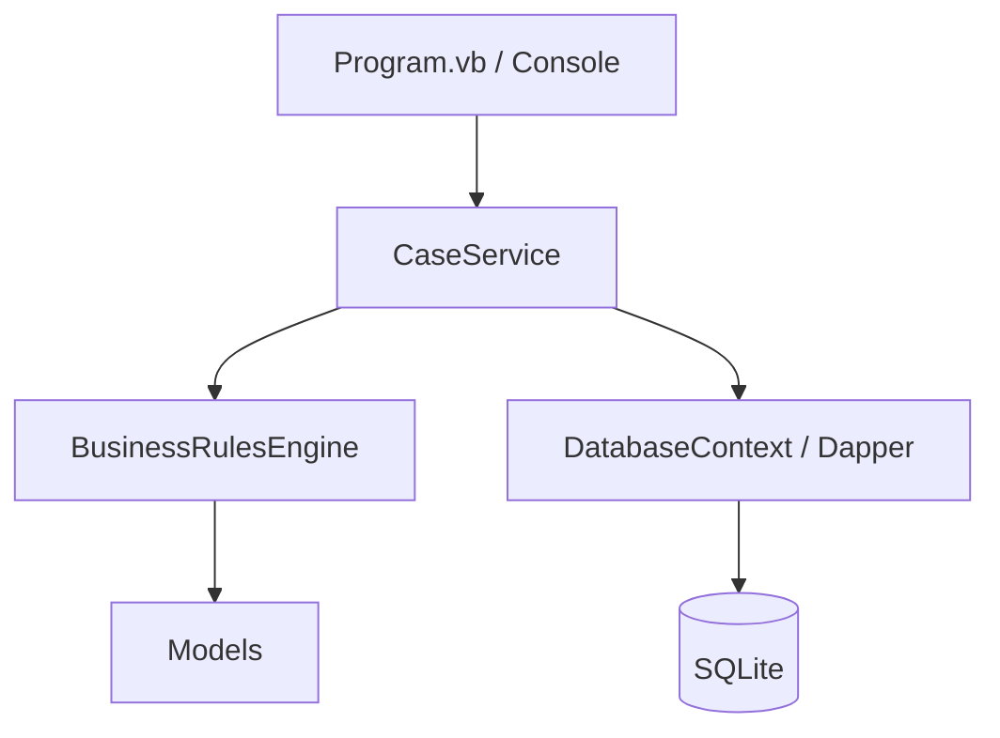

# GenTax-Inspired Revenue & Eligibility System

## Production Support & Change Management

This system is designed for high-availability government environments where policy changes occur frequently.

### Change Management
- **Rule Updates**: Business rules are stored in the `BusinessRules` table. To update a policy (e.g., change an income threshold), you can insert a new rule with a future `ValidFrom` date. The engine will automatically pick it up when that date is reached.
- **Versioning**: Old rules should have their `ValidTo` date updated to preserve history. This ensures that old cases are audited against the rules that were in effect at the time.

### Troubleshooting
- **Audit Trail**: Use the `AuditLogs` table to trace every state change. Each log entry captures the `ChangedBy` user and a clear `ActionType`.
- **System Integrity**: The `DatabaseContext` ensures the schema is initialized on startup. If columns need to be added, use a migration script in the `DataAccess` folder.

### Deployment
1. Ensure .NET 9.0+ is installed.
2. Run `dotnet restore`.
3. Run `dotnet run` to start the simulation.

## Quick Start Guide: How to Run the Simulator

Follow these steps to get the GenTaxSimulator running on your machine:

### 1. Prerequisites
- **.NET SDK**: Ensure you have .NET 9.0 or later installed. Verify with `dotnet --version`.
- **Dapper & SQLite**: The project dependencies are already configured in the `.vbproj` file.

### 2. Prepare the Environment
Open your terminal and navigate to the project root:
```bash
cd ../GenTaxSimulator
```

### 3. Restore and Build
Download the necessary NuGet packages and build the project:
```bash
dotnet restore
dotnet build
```

### 4. Run the Simulation
Start the program using the dotnet CLI:
```bash
dotnet run
```

### 5. Step-by-Step Simulation Walkthrough

Once the program is running, follow these steps to see the system in action:

#### Step 1: Trigger a Tax Penalty (California)
- **Action**: Enter `1` and press **Enter**.
- **What happens**: The system creates a new tax case for **John Doe** with an income of **$60,000**.
- **Expected Output**: You will see: `[RulesEngine] Rule 'High Income Penalty' triggered`. This proves the engine is evaluating rules stored in the database against the submitted case data.

#### Step 2: Trigger a Benefit Denial (Texas)
- **Action**: Enter `2` and press **Enter**.
- **What happens**: The system creates a SNAP Benefit case for **Jane Smith** with **100 days** of residency.
- **Expected Output**: Since Texas requires **183 days** for eligibility (as configured in the business rules table), the engine triggers an automatic **Denial**.

#### Step 3: Verify the Audit Trail & Persistence
- **Action**: Enter `3` and press **Enter**.
- **What happens**: The system queries the database to show all processed cases and the **System Audit Trail**.
- **What to look for**: Review the timestamped logs showing the `StatusChange` from `Submitted` -> `Approved` or `Denied`. It displays the precise **Old Value** and **New Value**, which is a critical requirement for government compliance.

#### Step 4: Generate the Accountability Report
- **Action**: Enter `4` and press **Enter**.
- **What happens**: This executes a complex SQL query joining `Clients`, `Programs`, `Cases`, and `AuditLogs` in a single operation.
- **Expected Output**: A formatted table showing total case counts by state, average incomes, and the "Last Activity" timestamp pulled from the audit logs. This demonstrates advanced data handling capabilities.

#### Step 5: Exit the System
- **Action**: Enter `5` and press **Enter**.
- **Result**: The program safely closes the database connection and terminates the simulation.

## Architecture Data Flow

